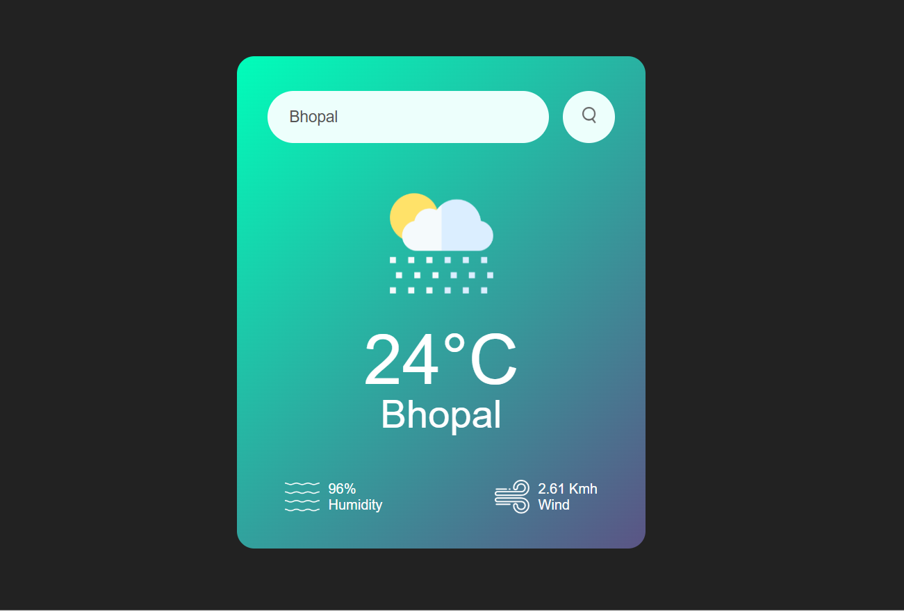

# 🌤️ Weather App

A simple and clean weather application built using HTML, CSS, and JavaScript that displays real-time weather information for any city using the **OpenWeatherMap API**.

---

## 📸 Preview

## 🔧 Tech Stack

- **HTML5** – Semantic and responsive page structure  
- **CSS3** – Styling and layout  
- **JavaScript (Vanilla)** – For API integration and DOM manipulation  
- **OpenWeatherMap API** – For live weather data

---

## ✨ Features

- 🔍 **City Search**: Enter any city name to get its current weather.
- 🌡️ **Live Temperature** in °C
- 💧 **Humidity** Display
- 🌬️ **Wind Speed** in km/h
- 🌤️ **Weather Icons** based on current conditions (Rain, Clouds, Clear, etc.)
- ⚠️ **Error Handling**: Shows message for invalid city input
- 📱 **Responsive UI** (Card-based layout)

---

## 🚀 Getting Started

## 🌐 Live Demo

🚀 https://beamish-yeot-055182.netlify.app/

## 📂 Repository

GitHub: https://github.com/Anisha-25-ap/Weather-App

weather-app/
│
├── images/
│   ├── search.png
│   ├── rain.png
│   ├── clouds.png
│   ├── clear.png
│   ├── humidity.png
│   └── wind.png
│
├── style.css
├── index.html

